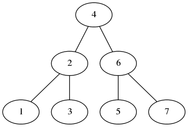

## Introduction

This is a project to host various puzzles solved using javascript.

### [Bracket reversal](app/puzzles/bracket_reversal.js)
Input:  exp = "}{"
Output: 2
We need to change '}' to '{' and '{' to
'}' so that the expression becomes balanced,
the balanced expression is '{}'

Input:  exp = "{{{"
Output: Can't be made balanced using reversals

Input:  exp = "{{{{"
Output: 2

Input:  exp = "{{{{}}"
Output: 1

Input:  exp = "}{{}}{{{"
Output: 3

### [Four 10s puzzle](app/four_tens/four_tens.js)
Given 4 10s and missing operators between,
use + - * / and lg() to solve.

```
  10   10   10   10 =  1
  10   10   10   10 =  2
  10   10   10   10 =  3
  10   10   10   10 =  4
  10   10   10   10 =  5
  10   10   10   10 =  6
  10   10   10   10 =  7
  10   10   10   10 =  8
  10   10   10   10 =  9
  10   10   10   10 = 10
```

### [Max swap](app/puzzles/max_swap.js)
A swap operation M on an array is defined where you can only swap the adjacent elements. Given an array containing digits and n swap operations (defined as below), maximize the value of the array.

Example: Array 1, 2, 4, 3 (value = 1243), Number of swaps 2

Output 4,1,2,3 (value = 4123).

### [Most frequent element](app/puzzles/most_freq.js)
Given an integer array, find the most frequent number and it's count in the array. Write the code in O(1) space.

Eg [3, 4, 5, 2, 2, 3, 2] Output Most frequent number is 2.

The frequency is 3. Return the output as string in 'number: frequency' format. e.g. 2: 3 (Please note the space after : and frequency. If multiple numbers have the same highest frequency return the smallest number.

### [Find Prime](app/puzzles/prime.js)
Check prime numbers.

### [Remove duplicates](app/puzzles/rm_dup.js)
Remove the duplicates from the array without extra space.

### [Count nodes by level](app/puzzles/node.js)
Write a program to find max number of nodes in a binary tree on any level.

### [Binary Search Tree(BST)](app/puzzles/bst.js)
 a tree is binary search tree if
   * every node in a node's left subtree is less than the data value of that node.
   * every node in a node's right subtree is greater than the data value of that node.

Find distance between any two node in a bst tree.



### [Fibonacci Sum](app/puzzles/fibonacci.js)
Sum up all even fibonacci numbers up to a given integer.

### [Poker](app/puzzles/poker.js)
Compare and determine winning poker hand.

## Run
```
ava install --global
npm install
npm test   # or   npm run test:watch
```
